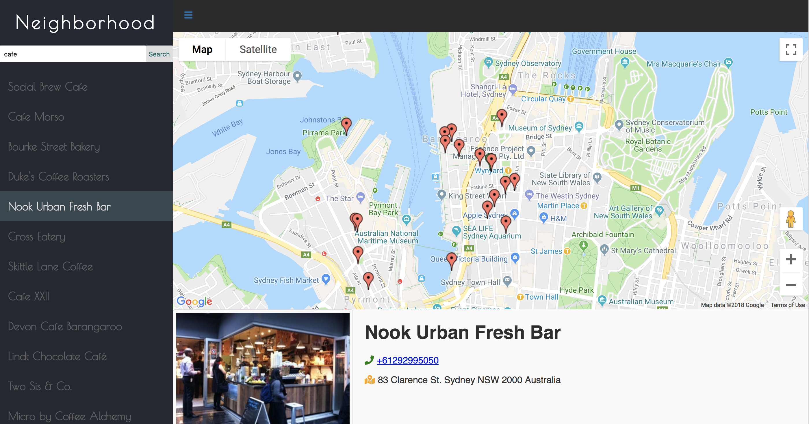

# Neighborhood

Neighborhood is an web app which you can search anything you are interested in your location, for example, restaurant, cafe, bakery, bar and so on. 

## How to start Neighborhood?

1. Click 'clone or download' button
2. Click 'Download ZIP'
3. Open project locally and...
* install all project dependencies with `npm install`
* start the development server with `npm start`

## Preview Neighborhood

## Third-party API
* Google place API
* Foursquare API

## Dependencies
npm, Node.js
